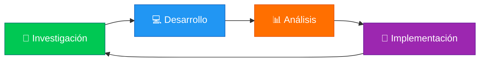

<div align="center">

# 🌐 GeoNexus

### *"Donde la ubicación se convierte en estrategia"*


---

### 🏛️ UNEG | 🎓 Ingeniería en Informática | 📚 Lenguajes y Compiladores 

</div>

---

## 🗺️ Sobre Nosotros

**GeoNexus** es un equipo multidisciplinario enfocado en la exploración y aplicación de conceptos avanzados en lenguajes de programación y teoría de compiladores. Combinamos análisis técnico con visión estratégica para transformar código en soluciones innovadoras.

<div align="center">



</div>

---

## 👥 Nuestro Equipo

<table align="center">
  <tr>
    <th>👤 Integrante</th>
  </tr>
  <tr>
    <td><b>Aponte Beatriz</b></td>
  </tr>
  <tr>
    <td><b>Rodríguez Samuel</b></td>
  </tr>
  <tr>
    <td><b>Castellano Omar</b></td>
  </tr>
  <tr>
    <td><b>Muñoz Elishama</b></td>
  </tr>
</table>

---

## 📂 Estructura del Repositorio

```
📦 GeoNexus
├── 📁 Tema1
│   └── 📄 Informe 1 - LLM para generación de código binario en Linux x64.pdf
└── 📄 README.md
```

---

## 🛠️ Tecnologías y Herramientas

<div align="center">


</div>

---

## 📋 Evaluaciones

### 🔄 Estado de Entregas

<div align="center">

| 📅 Tema | 📌 Tópico | 🎯 Estado | 🗓️ Fecha |
|---------|-----------|-----------|----------|
| **Tema 1** | LLM para generación de código binario en Linux x64 | ✅ Completado | 14-05-2026 |

</div>

---

<details>
<summary>💻 <b>Proyectos de Programación</b></summary>

### Programas en Desarrollo:
- 🔄 En actualización...

</details>

---

## 🚀 Reglas para Contribuir

1. **Fork** este repositorio
2. Crea una **rama** para tu evaluación (`git checkout -b evaluacion/tema`)
3. **Commit** tus cambios (`git commit -m 'Agregar evaluación X'`)
4. **Push** a la rama (`git push origin evaluacion/tema`)
5. Abre un **Pull Request** para revisión del equipo

---

## 📊 Estadísticas del Proyecto

<div align="center">


</div>

---

## 📞 Contacto

<div align="center">

¿Tienes preguntas o sugerencias? ¡Contáctanos!

[](mailto:beatriz-aponte@outlook.com)
[](https://github.com/AlgoBea/GeoNexus)

</div>

---

<div align="center">

### 🌟 "En GeoNexus, cada línea de código tiene su coordenada perfecta" 🌟

**Hecho con 💚 por el equipo GeoNexus**

*Universidad Nacional Experimental de Guayana (UNEG)*  
*Ingeniería en Informática | 2026-1*

---

[](https://forthebadge.com)
[](https://forthebadge.com)
[](https://forthebadge.com)

</div>
