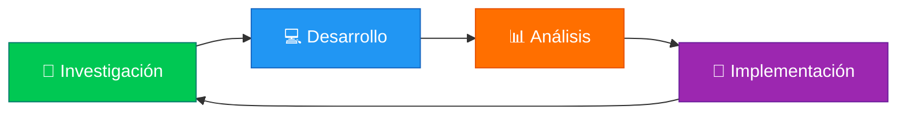

<div align="center">

# 🌐 GeoNexus

### *"Donde la ubicación se convierte en estrategia"*


---

### 📚 Lenguajes y Compiladores | 🎓 Ingeniería en Informática | 🏛️ UNEG

</div>

---

## 🗺️ Sobre Nosotros

**GeoNexus** es un equipo multidisciplinario enfocado en la exploración y aplicación de conceptos avanzados en lenguajes de programación y teoría de compiladores. Combinamos análisis técnico con visión estratégica para transformar código en soluciones innovadoras.

<div align="center">



</div>

---

## 👥 Nuestro Equipo

<table align="center">
  <tr>
    <th>👤 Integrante</th>
    <th>🎯 Rol</th>
    <th>📧 Contacto</th>
  </tr>
  <tr>
    <td><b>Rodríguez Samuel</b></td>
    <td>🏆 Líder de Equipo</td>
    <td><a href="mailto:samuel@example.com">📬</a></td>
  </tr>
  <tr>
    <td><b>Aponte Beatriz</b></td>
    <td>💻 Desarrolladora</td>
    <td><a href="mailto:beatriz@example.com">📬</a></td>
  </tr>
  <tr>
    <td><b>Castellano Omar</b></td>
    <td>🔍 Investigador</td>
    <td><a href="mailto:omar@example.com">📬</a></td>
  </tr>
  <tr>
    <td><b>Muñoz Elishama</b></td>
    <td>📊 Analista</td>
    <td><a href="mailto:elishama@example.com">📬</a></td>
  </tr>
</table>

---

## 📂 Estructura del Repositorio

```
📦 GeoNexus
├── 📁 Evaluaciones
│   ├── 📁 Evaluacion-01
│   │   ├── 📄 investigacion.md
│   │   ├── 💾 codigo/
│   │   └── 📊 presentacion.pdf
│   ├── 📁 Evaluacion-02
│   └── 📁 Evaluacion-03
├── 📁 Investigaciones
│   ├── 📄 Temas-Tech
│   └── 📄 Compiladores
├── 📁 Programas
│   ├── 💻 Analizador-Lexico
│   ├── 💻 Parser
│   └── 💻 Generador-Codigo
├── 📁 Recursos
│   ├── 📚 Bibliografia
│   └── 🔗 Enlaces-Utiles
└── 📄 README.md
```

---

## 🎯 Objetivos del Curso

<div align="center">

| 🎓 Área | 📝 Descripción |
|---------|----------------|
| **Teoría de Lenguajes** | Análisis de gramáticas, autómatas y expresiones regulares |
| **Diseño de Compiladores** | Fases de compilación: análisis léxico, sintáctico y semántico |
| **Implementación** | Desarrollo de compiladores y herramientas de procesamiento de lenguajes |
| **Optimización** | Técnicas de optimización de código intermedio y generación de código |

</div>

---

## 🛠️ Tecnologías y Herramientas

<div align="center">


</div>

---

## 📋 Evaluaciones

### 🔄 Estado de Entregas

<div align="center">

| 📅 Evaluación | 📌 Tema | 🎯 Estado | 🗓️ Fecha |
|---------------|---------|-----------|----------|
| **Evaluación 1** | Introducción a Compiladores | ⏳ En Progreso | TBD |
| **Evaluación 2** | Análisis Léxico | 📝 Pendiente | TBD |
| **Evaluación 3** | Análisis Sintáctico | 📝 Pendiente | TBD |
| **Evaluación 4** | Análisis Semántico | 📝 Pendiente | TBD |

</div>

**Leyenda:**
- ✅ Completado
- ⏳ En Progreso
- 📝 Pendiente
- ⚠️ Revisión

---

## 📚 Temas de Investigación

<details>
<summary>🔍 <b>Temas Tech (Click para expandir)</b></summary>

### Áreas de Investigación:
- 🤖 **Inteligencia Artificial y Compiladores**
- 🔐 **Seguridad en Lenguajes de Programación**
- ⚡ **Optimización de Código**
- 🌐 **Lenguajes de Dominio Específico (DSL)**
- 🔄 **Compilación Just-In-Time (JIT)**
- 📱 **Compiladores para Dispositivos Móviles**

</details>

<details>
<summary>💻 <b>Proyectos de Programación</b></summary>

### Programas en Desarrollo:
- 🔤 **Analizador Léxico**: Tokenización y reconocimiento de patrones
- 🌳 **Parser**: Análisis sintáctico y construcción de árboles
- 🧠 **Analizador Semántico**: Verificación de tipos y contexto
- ⚙️ **Generador de Código**: Generación de código intermedio/objeto
- 🎨 **Mini-Compilador**: Proyecto integrador completo

</details>

---

## 🚀 Cómo Contribuir

1. **Fork** este repositorio
2. Crea una **rama** para tu evaluación (`git checkout -b evaluacion/tema`)
3. **Commit** tus cambios (`git commit -m 'Agregar evaluación X'`)
4. **Push** a la rama (`git push origin evaluacion/tema`)
5. Abre un **Pull Request** para revisión del líder

---

## 📖 Recursos Útiles

<div align="center">

[](https://en.wikipedia.org/wiki/Compilers:_Principles,_Techniques,_and_Tools)
[](https://llvm.org/docs/)
[](https://gcc.gnu.org/onlinedocs/)

</div>

---

## 📊 Estadísticas del Proyecto

<div align="center">


</div>

---

## 📞 Contacto

<div align="center">

¿Tienes preguntas o sugerencias? ¡Contáctanos!

[](mailto:geonexus@uneg.edu)
[](https://github.com/tu-usuario/geonexus)

</div>

---

<div align="center">

### 🌟 "En GeoNexus, cada línea de código tiene su coordenada perfecta" 🌟


**Hecho con 💚 por el equipo GeoNexus**

*Universidad Nacional Experimental de Guayana (UNEG)*  
*Ingeniería en Informática | 2024-2025*

---

[](https://forthebadge.com)
[](https://forthebadge.com)
[](https://forthebadge.com)

</div>
